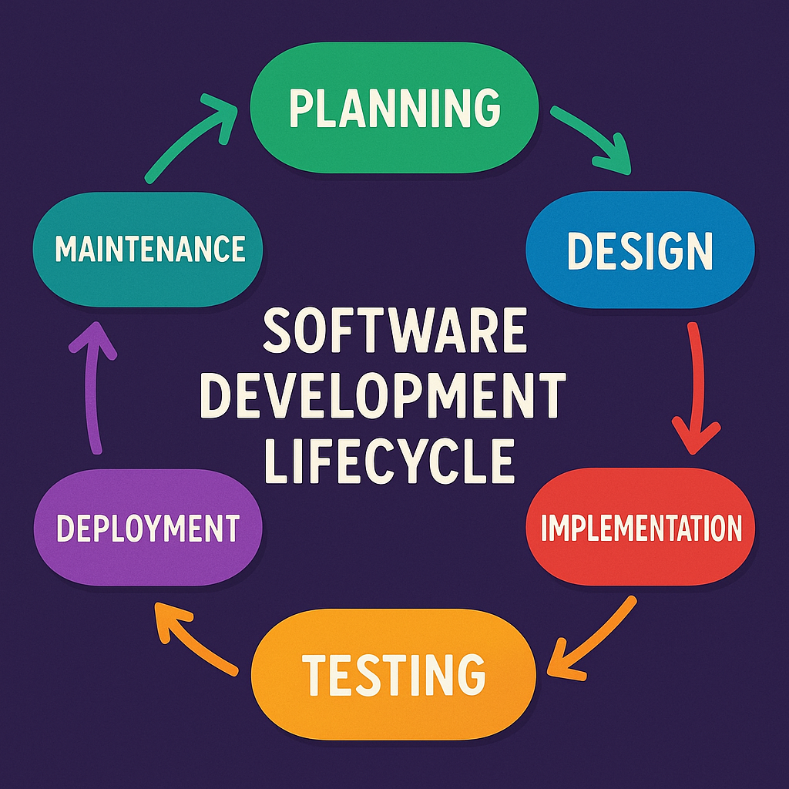

# Week 02 - Markdown, Code Snippets and Testing

## Part 1: Markdown Basics

## Learning Objectives
- Understand Markdown syntax and its importance in documentation
- Learn how to preview Markdown in Cursor
- Practice creating documentation with various Markdown elements
- Learn to link and embed content in Markdown
- Push documentation to GitHub and view it online

## Introduction to Markdown
Markdown is a lightweight markup language that you can use to add formatting elements to plaintext text documents. It's widely used for:
- README files
- Documentation
- Technical writing
- Note-taking
- And much more!

## Key Markdown Features

### 1. Headers
Basic syntax:
```markdown
# Header 1
## Header 2
### Header 3
#### Header 4
```

Example result:
# Header 1
## Header 2
### Header 3
#### Header 4

### 2. Text Formatting
Basic syntax:
```markdown
*Italic text* or _italic text_
**Bold text** or __bold text__
~~Strikethrough text~~
```

Example result:
*Italic text* or _italic text_
**Bold text** or __bold text__
~~Strikethrough text~~

### 3. Lists
Basic syntax:
```markdown
- Unordered list item
- Another item
  - Subitem (indent with 2 spaces)

1. Ordered list item
2. Second item
   1. Subitem (indent with 3 spaces)
```

Example result:
- Unordered list item
- Another item
  - Subitem (indent with 2 spaces)

1. Ordered list item
2. Second item
   1. Subitem (indent with 3 spaces)

### 4. Links and References
Basic syntax:
```markdown
[Link text](https://www.example.com)
[Link with title](https://www.example.com "Link title")

Reference-style links:
[Link text][reference]
[Another link][ref2]

[reference]: https://www.example.com
[ref2]: https://www.example.com/docs "Optional title"
```

Example result:
[Python Tutorial](https://docs.python.org/3/tutorial/index.html)
[Javascript Documentation](https://developer.mozilla.org/en-US/docs/Web/JavaScript "Javascript Documentation")

Reference-style links:
Here you can find the official[python flask Documentation][reference] and also the [vue.js Documentation][ref2]. These two are web development frameworks and so being able to build software faster. There exist many other frontend frameworks and backend frameworks. 

[reference]: (https://flask.palletsprojects.com/en/stable/installation/#install-flask)
[ref2]: https://vuejs.org/guide/introduction "vue js documentation"

### 5. Images
Basic syntax:
```markdown

```

Example:


### 6. Code Blocks
To create code blocks, use triple backticks with the language name.

Basic syntax:
````markdown
```python
def hello_world():
    print("Hello, World!")
```
````

Example result:
```python
def hello_world():
    print("Hello, World!")
```

### 7. Tables
```markdown
| Header 1 | Header 2 |
|----------|----------|
| Cell 1   | Cell 2   |
```

## Previewing Markdown in Cursor

1. Open your Markdown file in Cursor
2. Press `Ctrl+Shift+V` (Windows) or `Cmd+Shift+V` (Mac) to open the preview
3. The preview will update in real-time as you edit


## Additional Resources

- [Markdown Guide](https://www.markdownguide.org/)

## Using AI as Your Learning Partner

As you work through these exercises, you have access to AI tools that can assist you in your learning journey. Here's how to use AI effectively:

### Best Practices for AI-Assisted Learning
- **Step-by-Step Approach**: Don't ask AI to solve all tasks at once. Break down problems and work through them gradually to build understanding.
- **Active Learning**: Use AI as a coding partner to discuss concepts, ask questions, and get explanations. This helps you learn the language more effectively.
- **Think First**: Try to understand the problem and attempt a solution before asking AI for help. This builds problem-solving skills.
- **Ask for Explanations**: When AI provides a solution, ask it to explain the code and concepts you don't understand.
- **Iterate and Experiment**: Use AI to explore different approaches and understand trade-offs between solutions.

### What to Ask AI
- Clarification of concepts
- Code review and improvements
- Debugging help
- Best practices and conventions
- Alternative approaches to problems

### What Not to Do
- Don't ask AI to complete all exercises at once
- Avoid copying solutions without understanding them
- Don't skip the learning process by having AI do all the work

Remember: AI is a tool to enhance your learning, not replace it. The goal is to become a better programmer by engaging actively with the material and using AI as a supportive learning partner.

## Part 2: Code Snippets with JavaScript and Python

In this section, we'll explore writing and comparing code snippets in both JavaScript and Python. We'll focus on basic functionality and syntax differences between the two languages.

### Exercise 1: Basic Functions
Create functions in both languages that demonstrate:
- Basic arithmetic operations
- String manipulation 
- Array/List operations

### Exercise 2: Data Structures
Compare how to work with:
- Arrays/Lists
- Objects/Dictionaries
- Sets

### Exercise 3: Control Flow
Implement examples of:
- Conditional statements
- Loops
- Error handling

## Part 3: Testing Fundamentals

In this section, we'll learn the basics of testing using Jest for JavaScript and unittest for Python.

### JavaScript Testing with Jest
Jest is a delightful JavaScript testing framework maintained by Facebook. It's known for its simplicity and powerful features.

Official documentation: https://jestjs.io/

Key concepts we'll cover:
- Writing basic tests
- Using matchers
- Test organization
- Running tests

### Python Testing with unittest
unittest is Python's built-in testing framework, inspired by JUnit and has a similar flavor to major unit testing frameworks in other languages.

Official documentation: https://docs.python.org/3/library/unittest.html

Key concepts we'll cover:
- Test cases
- Assertions
- Test suites
- Running tests

### Exercise 1: First Tests
Write basic tests for the functions created in Part 2 using both Jest and unittest.

### Exercise 2: Test Organization
Learn how to:
- Structure test files
- Group related tests
- Use test fixtures
- Handle test setup and teardown

### Exercise 3: Test Coverage
Understand:
- What is test coverage
- How to measure it
- Best practices for test coverage

## Part 4: Building Your Portfolio

This week's exercises provide an excellent opportunity to start building your professional portfolio on GitHub. Here's how to showcase your work:

### GitHub Repository
- Create a dedicated repository for these exercises
- Upload your code snippets and tests
- Use clear directory structure to organize your work (e.g., `/javascript`, `/python`, `/tests`)
- Include a well-structured README.md file

### Documentation
- Use your Markdown skills to create comprehensive documentation
- Link to specific code files and test files from your documentation
- Explain your implementation choices and what you learned
- Include examples of test outputs and code execution results

### Portfolio Benefits
- Demonstrates both coding and documentation skills
- Shows understanding of multiple languages (JavaScript and Python)
- Exhibits testing knowledge and quality assurance mindset
- Provides a practical example of your ability to explain technical concepts
- Creates a foundation for your professional portfolio that you can expand upon

### Example Structure
```markdown
# My Week 2 Project
## JavaScript Implementation
- [Basic Functions](./javascript/basic-functions.js)
- [Test Cases](./javascript/tests/basic-functions.test.js)

## Python Implementation
- [Basic Functions](./python/basic_functions.py)
- [Test Cases](./python/tests/test_basic_functions.py)

## What I Learned
- Language comparison insights
- Testing methodologies
- Documentation best practices
```

Remember to commit your changes regularly and use meaningful commit messages. This helps create a clear history of your learning progress and demonstrates good version control practices.

## Resources

### JavaScript/Jest Resources
- [Jest Official Documentation](https://jestjs.io/)
- [Jest Getting Started Guide](https://jestjs.io/docs/getting-started)
- [JavaScript MDN Documentation](https://developer.mozilla.org/en-US/docs/Web/JavaScript)

### Python/unittest Resources
- [unittest Documentation](https://docs.python.org/3/library/unittest.html)
- [Python Official Documentation](https://docs.python.org/3/)
- [Real Python Testing Tutorial](https://realpython.com/python-testing/)
